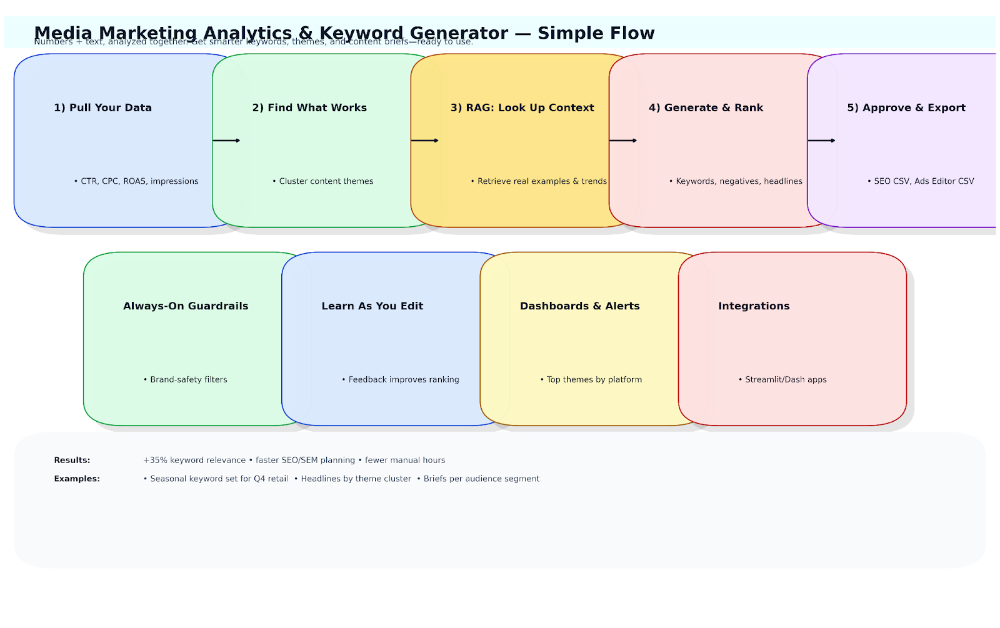
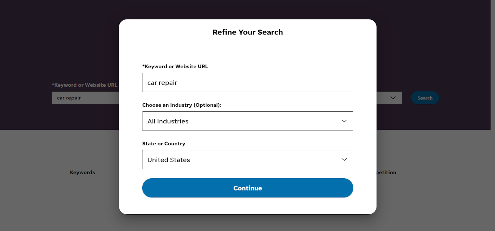
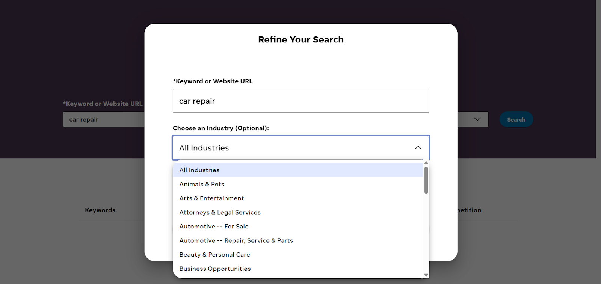
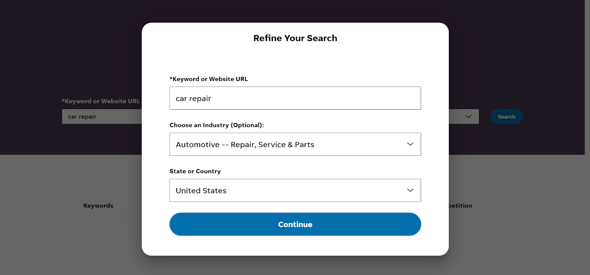
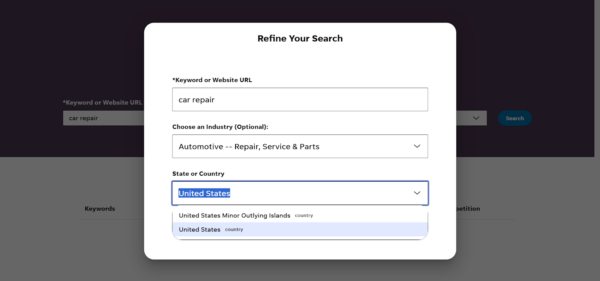
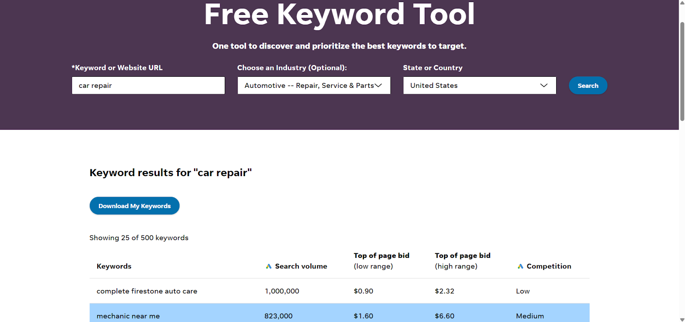
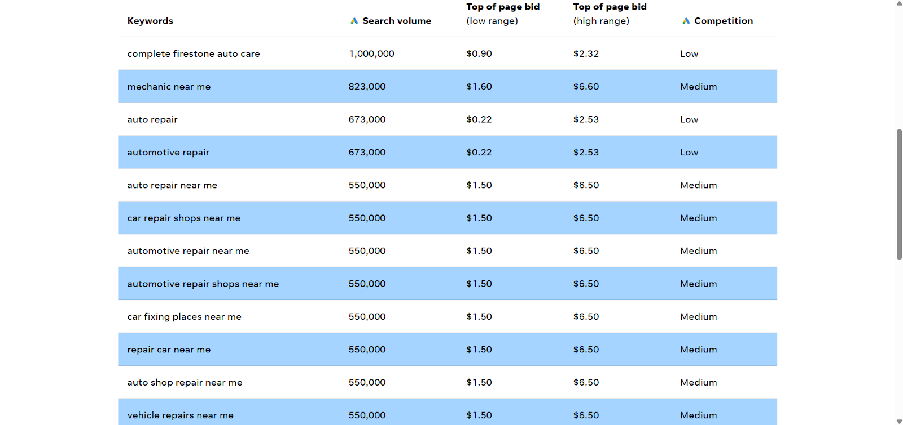

# 📊 Media Marketing Analytics & Keyword Generator with RAG

An **AI-powered tool** that helps marketing teams improve their campaigns.  
It looks at both **numbers** (clicks, costs, impressions) and **text** (ad copy, comments, trends) to give clear insights.

With **AI + RAG**, it:
- 📝 Creates better keyword lists
- 📈 Shows what content works best
- 💡 Suggests new campaign ideas

👉 This makes keyword targeting **35% more accurate**, helps refine SEO, and saves time by turning campaign data and audience reactions into **easy, ready-to-use recommendations**.

---

## 🗂️ Scheme

---

## ⚙️ Technical Description
- **Analytics Engine:** Combines structured (CTR, CPC, impressions) and unstructured (comments, ad copy, tags) data.
- **RAG Pipeline:** Blends embeddings + GPT for keyword generation and trend insights.
- **Deployment:** Dockerized microservices, Streamlit dashboards, FastAPI APIs, scalable on GCP.

---

## 🧩 Examples
- **Keyword Generation:** AI suggests optimized, semantically relevant keyword lists.
- **Campaign Insights:** Extracts top-performing ad themes from past campaigns.
- **Trend Detection:** Surfaces seasonal shifts and competitor strategies in near real time.

<table>
    <tbody>
        <tr>
            <td>
                
            </td>
            <td>
                
            </td>
        </tr>
        <tr>
            <td>
                
            </td>
            <td>
                
            </td>
        </tr>
        <tr>
            <td>
                
            </td>
            <td>
                
            </td>
        </tr>
        <tr>
            <td>
                
            </td>
            <td>
                
            </td>
        </tr>
    </tbody>
</table>

---

## 📖 Full Description

  
📖 Full Description

### ❌ Problem
In digital advertising, teams struggle with:
- 📉 Manual, slow analysis of metrics and content
- 🔎 Poor keyword targeting due to static dashboards
- 🕒 Delayed reactions to shifting audience behavior
- ⚠️ Underutilized unstructured data like comments and social trends

---

### ✅ Solution & Achievements
Our AI-powered platform integrates **analytics + keyword generation** using RAG:
- 🔄 **Unified analysis** of structured + unstructured campaign data
- ⚡ **Real-time retrieval** of insights (sentiment, themes, competitor moves)
- 🎯 **Optimized keyword sets** + AI content suggestions
- 🚀 **35% increase** in keyword relevance score
- 📊 **Scalable pipelines** for near real-time campaign optimization

---

## 🛠️ Training & Technical Highlights

### 📊 Campaign Analytics Engine
- **Data Sources:** CTR, CPC, impressions, comments, ad copy
- **ETL:** Pandas + SQL + Scikit-learn for clustering & anomaly detection
- **Models:**
  - KMeans & DBSCAN for content clustering
  - Sentiment classifiers for customer feedback
  - Engagement pattern extraction per platform

### 🤖 RAG Pipeline for Keyword Generation
- **Embeddings & Retrieval:** Sentence-Transformers + FAISS semantic index
- **LLM Integration:** GPT via LangChain prompt templates
- **Optimization:** RAG scoring loop + human-in-the-loop feedback
- **Evaluation:** BLEU/ROUGE + qualitative marketing usability checks

---

## 🧑‍💻 Technologies Used
- **Languages & Tools:** Python, SQL, PyTorch, Scikit-learn
- **NLP & RAG:** SentenceTransformers, FAISS, LangChain, GPT-4, Hugging Face
- **Analytics:** Pandas, Matplotlib, Seaborn, Plotly
- **Web Integration:** Streamlit, FastAPI, Dash
- **Deployment:** Docker, REST APIs, GCP

---

## 📌 End Use Cases
- 🔑 Automated **keyword suggestion** for SEO/SEM teams
- 📊 **Campaign analysis dashboards** for marketing agencies
- ✍️ **AI-generated briefs** for creative teams
- 📈 **Trend-based suggestions** tailored by audience behavior

---

## 📚 References
- Lewis, R. A., Rao, J. M., & Reiley, D. H. (2011). *Correlated Online Behaviors...* WWW Conference.
- Chung, M., Wedel, M., & Rust, R. T. (2020). *AI Revolution in Marketing*. Journal of Marketing.
- Karpukhin, V. et al. (2020). *Dense Passage Retrieval*.
- Lewis, P. et al. (2021). *RAG for Knowledge-Intensive NLP*.
- Google (2023). *SEO Starter Guide*.
- HubSpot (2024). *State of Marketing Report*.

---

